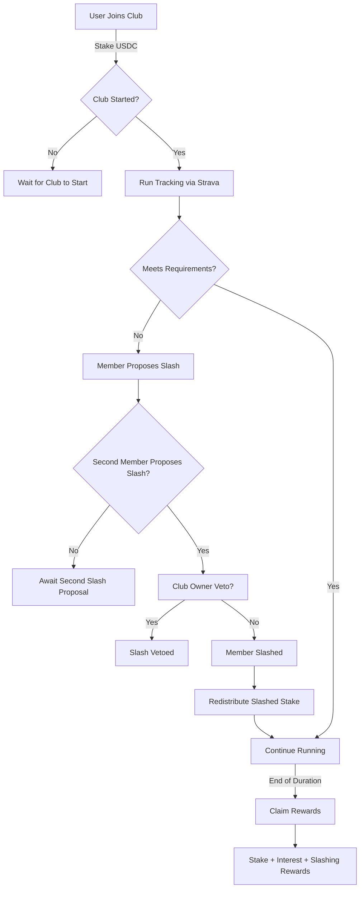
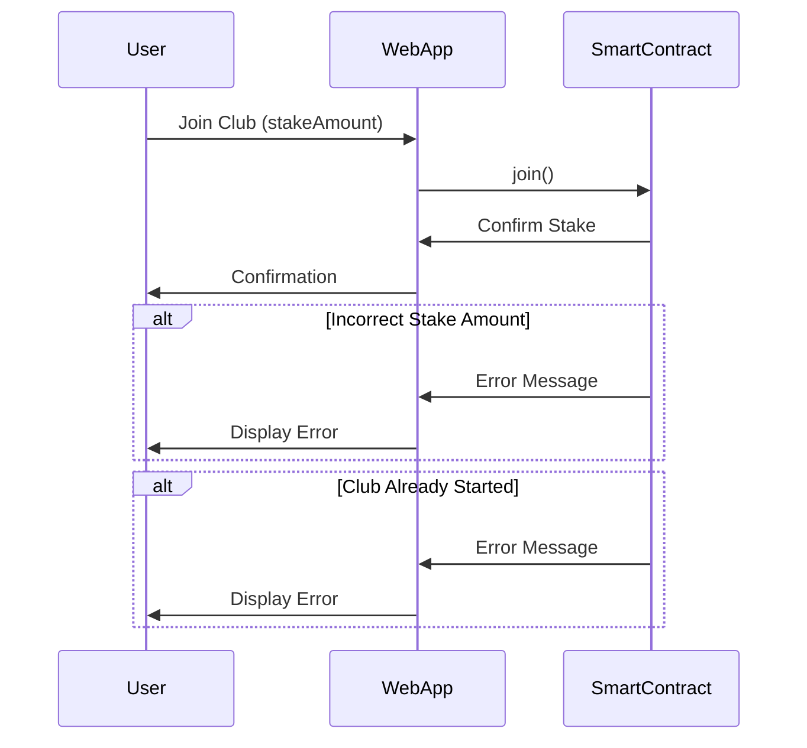
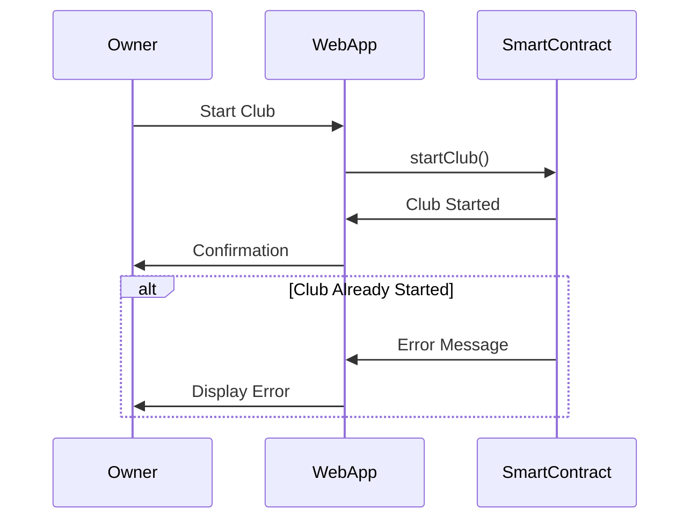
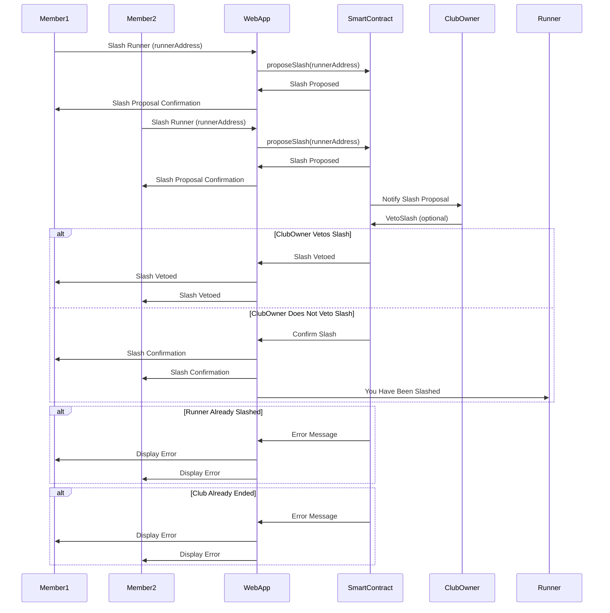
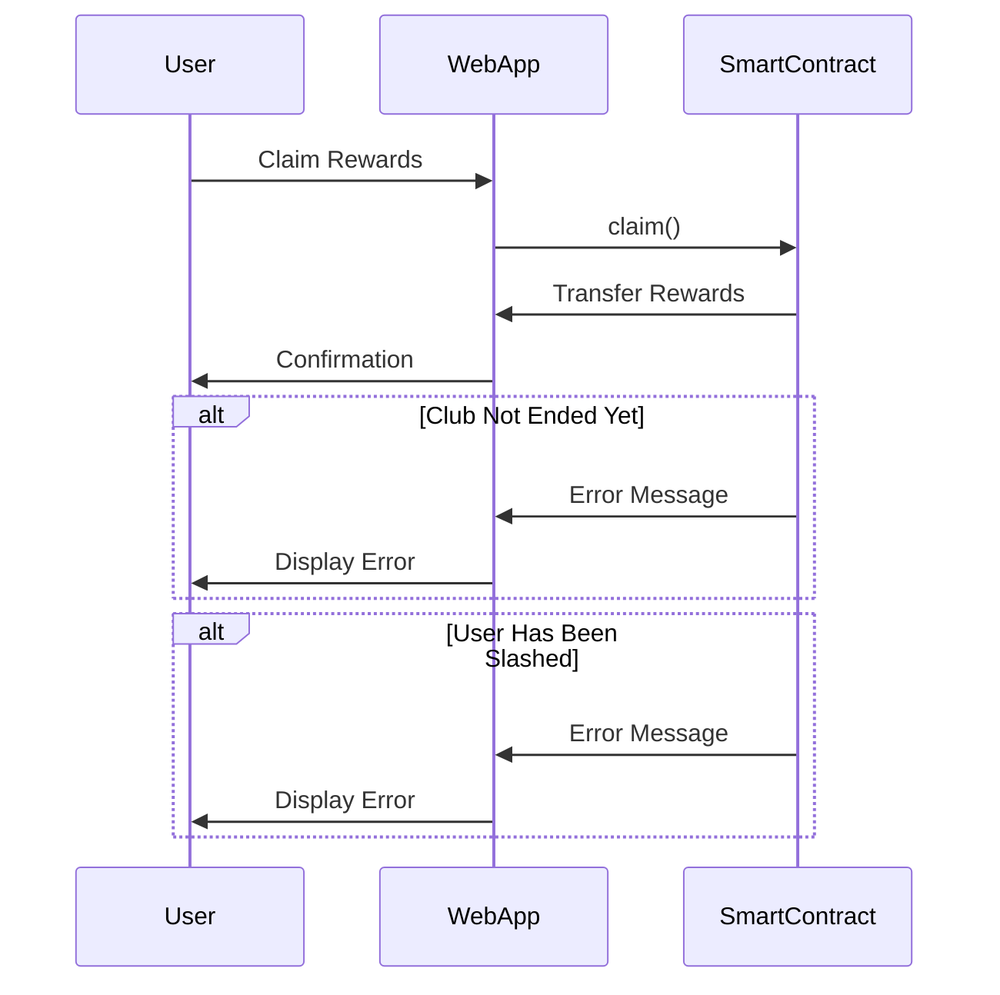

# Saverava White Paper

## Introduction

Saverava is a savings game you play with your running buddies. It merges [Strava](https://www.strava.com/) running [clubs](https://business.strava.com/blog/strava-clubs-vs-traditional-social-media) with web3 wallets for a unique "run-to-earn" experience that encourages saving money and being active. Runners join clubs, stake USDC, and track their activity via the Strava application on their phone. Clubs have requirements for activity. If a runner doesn't meet the club's requirements, they can be slashed by other members. They will lose their USDC stake and it is redistributed to compliant members. At the end of the club duration, successful runners can reclaim their stake along with interest and additional rewards, promoting commitment and discipline.

## How It Works

1. **Join a Club**: Runners join a running club through the Saverava application.
2. **Club Requirements**: Each club has specific requirements that members must meet, including:
   - Number of miles to run
   - Frequency of runs (e.g., weekly)
   - Duration (e.g., 3 months)
3. **Staking**: Runners stake a specified amount of USDC to join a club.
4. **Tracking Progress**: Runs are tracked via Strava integration.
5. **Social Slashing**: Members can slash others who do not meet the club's requirements.
6. **Distribution of Stakes**: When a runner is slashed, their stake is distributed proportionally among the remaining members.
7. **End of Duration**: At the end of the club duration, runners who have not been slashed can claim their initial stake plus any interest earned and shares from social slashing.

### A Real Example

#### Scenario

Let's walk through a real example to illustrate how Saverava works. Suppose we have a running club called "10-Mile Challengers" with the following requirements:
- Each member must run at least 10 miles per week.
- The challenge lasts for 3 months.
- Each member stakes 50 USDC to join.

**Members:**
- Alice
- Bob
- Charlie
- Dave (Club Owner)

#### Joining the Club

1. **Alice, Bob, and Charlie** decide to join "10-Mile Challengers."
2. **Alice** stakes 50 USDC and joins the club.
3. **Bob** stakes 50 USDC and joins the club.
4. **Charlie** stakes 50 USDC and joins the club.
5. **Dave** (Club Owner) stakes 50 USDC and joins the club.

#### Running and Tracking

1. Each member uses Strava to track their runs.
2. In the first week, Alice and Bob complete their 10 miles, but Charlie only runs 5 miles.

#### Social Slashing

1. **Alice** notices that **Charlie** did not meet the 10-mile requirement and proposes to slash him.
2. **Bob** also proposes to slash **Charlie** for not meeting the requirement.
3. The smart contract records these proposals and notifies **Dave** (the Club Owner).

#### Club Owner Veto

1. **Dave** reviews the slash proposals.
2. **Dave** decides not to veto the slashing.

#### Slashing Execution

1. Since **Charlie** has been slashed by two members and the club owner did not veto, the smart contract confirms the slashing.
2. **Charlie's** 50 USDC stake is distributed among **Alice**, **Bob**, and **Dave** proportionally.
3. **Alice**, **Bob**, and **Dave** each receive 16.67 USDC from **Charlie's** stake.

#### Completion of Duration

1. At the end of the 3-month duration, **Alice**, **Bob**, and **Dave** have consistently met the 10-mile requirement every week.
2. **Alice**, **Bob**, and **Dave** can claim back their initial 50 USDC stake plus any additional USDC earned from slashing incidents and interest.
3. **Charlie** does not receive any USDC back because he was slashed.

#### Summary

- **Alice, Bob, and Dave** each claim back their initial 50 USDC plus 16.67 USDC from Charlie’s slashing, resulting in a total of 66.67 USDC.
- **Charlie** loses his entire 50 USDC stake due to not meeting the club’s requirements.

This example demonstrates how Saverava's combination of Strava integration, staking, and social slashing mechanisms ensures fair play and rewards consistent runners.

## Application Architecture

### Frontend

**Technology Stack**: Next.js, Typescript, wagmi, Rainbowkit, Coinbase Smart Wallet

**Pages and Components**:
- **Login Page**: Authentication via Strava
- **Dashboard**: Overview of clubs, personal statistics, and upcoming runs
- **Club View**: Details of a specific club, including members and their progress
- **Activity View**: Detailed view of individual activities
- **Profile Page**: User profile and settings

**Components**:
- **ClubCard**: Displays summary of a club
- **RunTracker**: Integrates with Strava API to show run details
- **StakingModal**: Modal for staking USDC to join a club
- **SlashButton**: Allows members to slash non-compliant runners
- **ClaimRewardsButton**: Enables eligible members to claim their rewards at the end of the duration

### Backend

**Technology Stack**: Node.js, Express, MongoDB, Web3.js, Strava API

**Endpoints**:
- **/auth/strava**: Authentication and login through Strava
- **/clubs**: Fetches available clubs and their details
- **/clubs/join**: Endpoint to join a club and stake USDC
- **/clubs/slash**: Endpoint to slash a non-compliant runner
- **/clubs/claim**: Endpoint to claim rewards at the end of the duration
- **/activities**: Fetches activities from Strava

## Smart Contract Architecture

### Club Pool Contract
```solidity
// SPDX-License-Identifier: MIT
pragma solidity ^0.8.0;

/// @title IClubPool Interface
/// @notice Interface for the ClubPool contract
interface IClubPool {

    /// @notice Event emitted when a member joins the club
    /// @param member The address of the member
    /// @param amount The amount staked by the member
    event Joined(address indexed member, uint256 amount);

    /// @notice Event emitted when a runner is slashed
    /// @param runner The address of the slashed runner
    event Slashed(address indexed runner);

    /// @notice Event emitted when a slashing is vetoed by the owner
    /// @param runner The address of the runner whose slashing was vetoed
    event Vetoed(address indexed runner);

    /// @notice Event emitted when a member claims their stake and rewards
    /// @param member The address of the member
    /// @param amount The total amount claimed by the member
    event Claimed(address indexed member, uint256 amount);

    /// @notice Allows a user to join the club by staking the required amount of USDC
    /// @dev Emits a `Joined` event upon successful join
    function join() external payable;

    /// @notice Starts the club, setting the start and end times based on the duration
    /// @dev Can only be called by the owner and only if the club has not started
    function startClub() external;

    /// @notice Proposes to slash a runner who has not met the club's requirements
    /// @param _runner The address of the runner to be slashed
    /// @dev Emits a `Slashed` event if the runner is successfully slashed
    function proposeSlash(address _runner) external;

    /// @notice Allows the club owner to veto a slashing proposal
    /// @param _runner The address of the runner whose slashing is to be vetoed
    /// @dev Emits a `Vetoed` event upon successful veto
    function vetoSlash(address _runner) external;

    /// @notice Allows members who have not been slashed to claim their initial stake plus any additional USDC earned from slashed stakes
    /// @dev Emits a `Claimed` event upon successful claim
    function claim() external;

    /// @notice Gets the total amount of stakes in the club
    /// @return The total stakes in the club
    function totalStakes() external view returns (uint256);

    /// @notice Checks if a runner is slashed
    /// @param _runner The address of the runner
    /// @return True if the runner is slashed, otherwise false
    function isSlashed(address _runner) external view returns (bool);

    /// @notice Gets the amount staked by a member
    /// @param _member The address of the member
    /// @return The amount staked by the member
    function stakes(address _member) external view returns (uint256);

    /// @notice Gets the number of slash votes for a runner
    /// @param _runner The address of the runner
    /// @return The number of slash votes for the runner
    function slashVotes(address _runner) external view returns (uint256);
}

```

## User Flow Diagrams

#### Club Life Cycle


#### Joining a Club



#### Starting the Club



#### Proposing a Slash



#### Claiming Rewards




These diagrams outline the key interactions between users, the web application, and the smart contracts for joining a club, slashing a runner, and claiming rewards.

