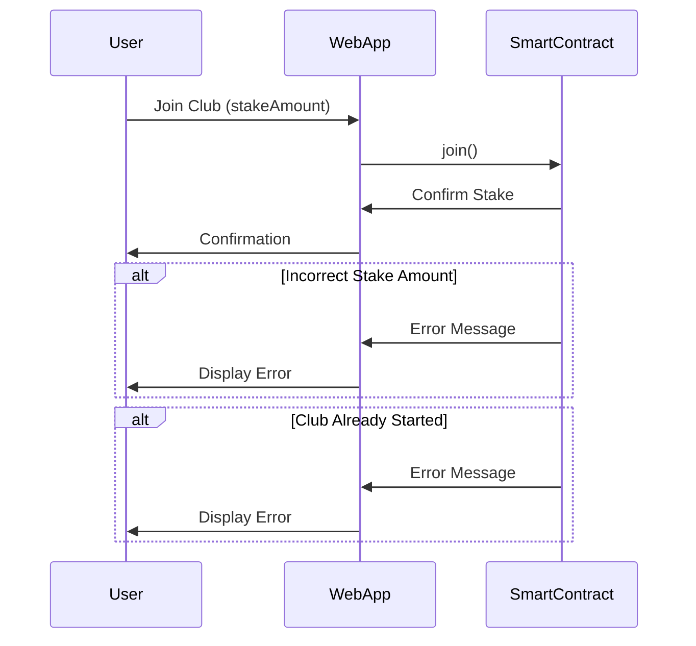
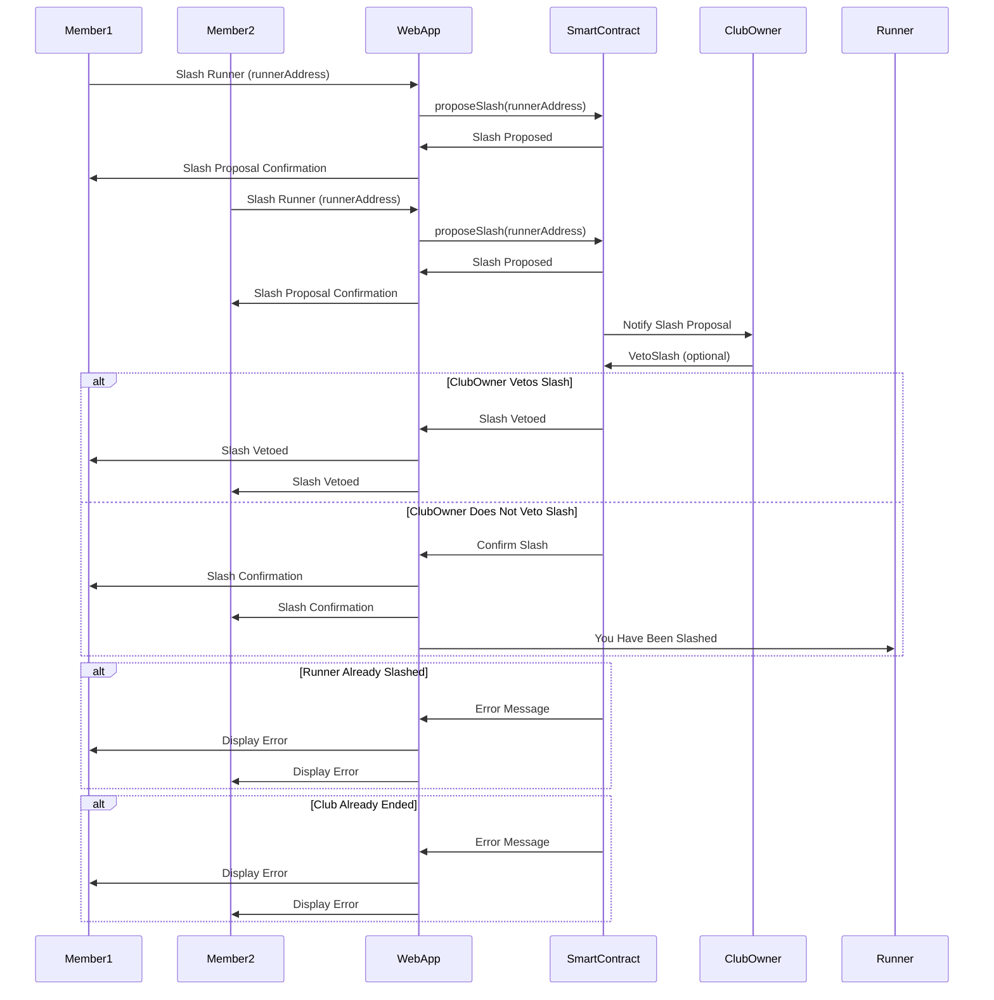
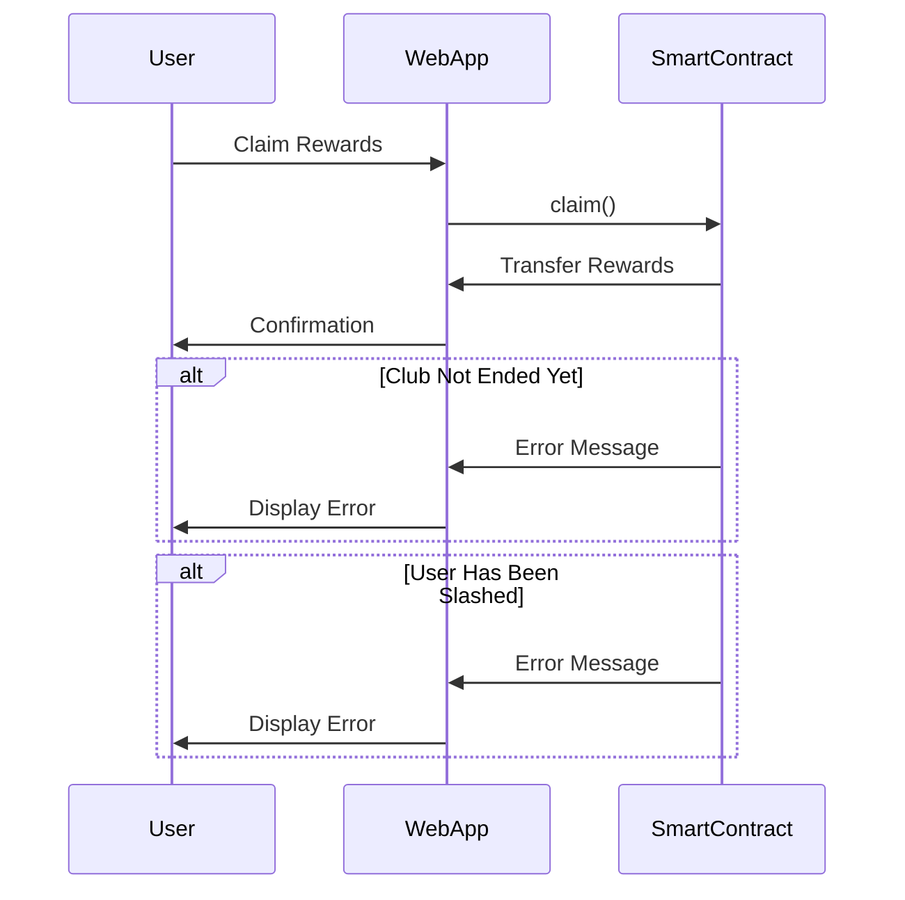

# Saverava White Paper

## Introduction

Saverava merges Strava running clubs with web3 wallets for a unique "run-to-earn" experience. Runners join clubs, stake USDC, and track their progress via Strava. If a runner doesn't meet the club's requirements, they can be slashed by other members, losing their USDC stake, which is then redistributed to compliant members. At the end of the club duration, successful runners can reclaim their stake along with interest and additional rewards, promoting commitment and discipline.

## How It Works

1. **Join a Club**: Runners join a running club through the Saverava application.
2. **Club Requirements**: Each club has specific requirements that members must meet, including:
   - Number of miles to run
   - Frequency of runs (e.g., weekly)
   - Duration (e.g., 3 months)
3. **Staking**: Runners stake a specified amount of USDC to join a club.
4. **Tracking Progress**: Runs are tracked via Strava integration.
5. **Social Slashing**: Members can slash others who do not meet the club's requirements.
6. **Distribution of Stakes**: When a runner is slashed, their stake is distributed proportionally among the remaining members.
7. **End of Duration**: At the end of the club duration, runners who have not been slashed can claim their initial stake plus any interest earned and shares from social slashing.

## Application Architecture

### Frontend

**Technology Stack**: Next.js, Typescript, wagmi, Rainbowkit, Coinbase Smart Wallet

**Pages and Components**:
- **Login Page**: Authentication via Strava
- **Dashboard**: Overview of clubs, personal statistics, and upcoming runs
- **Club View**: Details of a specific club, including members and their progress
- **Activity View**: Detailed view of individual activities
- **Profile Page**: User profile and settings

**Components**:
- **ClubCard**: Displays summary of a club
- **RunTracker**: Integrates with Strava API to show run details
- **StakingModal**: Modal for staking USDC to join a club
- **SlashButton**: Allows members to slash non-compliant runners
- **ClaimRewardsButton**: Enables eligible members to claim their rewards at the end of the duration

### Backend

**Technology Stack**: Node.js, Express, MongoDB, Web3.js, Strava API

**Endpoints**:
- **/auth/strava**: Authentication and login through Strava
- **/clubs**: Fetches available clubs and their details
- **/clubs/join**: Endpoint to join a club and stake USDC
- **/clubs/slash**: Endpoint to slash a non-compliant runner
- **/clubs/claim**: Endpoint to claim rewards at the end of the duration
- **/activities**: Fetches activities from Strava

## Sample Smart Contract Interfaces

**Join Pool Contract**:
```solidity
pragma solidity ^0.8.0;

contract ClubPool {
    address public owner;
    uint256 public stakeAmount;
    uint256 public duration;
    uint256 public startTime;
    uint256 public endTime;
    mapping(address => uint256) public stakes;
    mapping(address => bool) public isSlashed;

    constructor(uint256 _stakeAmount, uint256 _duration) {
        owner = msg.sender;
        stakeAmount = _stakeAmount;
        duration = _duration;
        startTime = block.timestamp;
        endTime = block.timestamp + _duration;
    }

    function join() public payable {
        require(msg.value == stakeAmount, "Incorrect stake amount");
        require(block.timestamp < startTime, "Club already started");
        stakes[msg.sender] += msg.value;
    }

    function slash(address _runner) public {
        require(block.timestamp < endTime, "Club already ended");
        require(!isSlashed[_runner], "Runner already slashed");
        isSlashed[_runner] = true;
    }

    function claim() public {
        require(block.timestamp >= endTime, "Club not ended yet");
        require(!isSlashed[msg.sender], "You have been slashed");
        uint256 reward = stakes[msg.sender]; // Calculate rewards
        stakes[msg.sender] = 0;
        payable(msg.sender).transfer(reward);
    }
}
```
## Diagrams

### Join Pool Contract Sequence Diagram



### Slash Runner Sequence Diagram



### Claim Rewards Sequence Diagram



These diagrams outline the key interactions between users, the web application, and the smart contracts for joining a club, slashing a runner, and claiming rewards.

